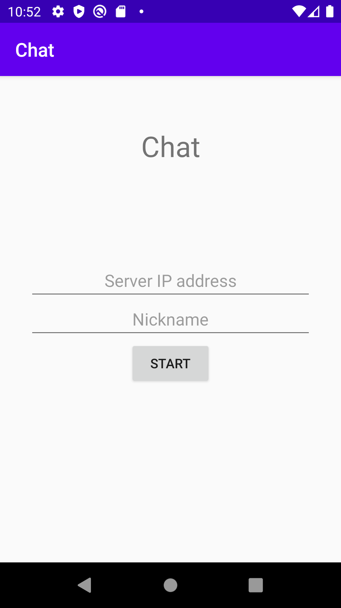
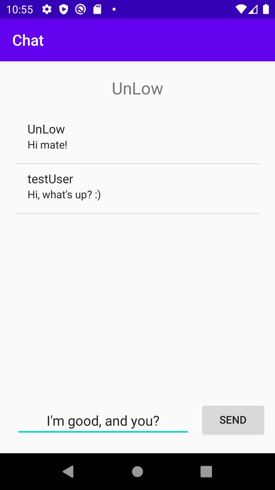

# Android chat with usage of MQTT
Application provide simple chat where user subscribes all topics. So when someone will publish any message then it will be received by all users.

## Screenshots from application

 

